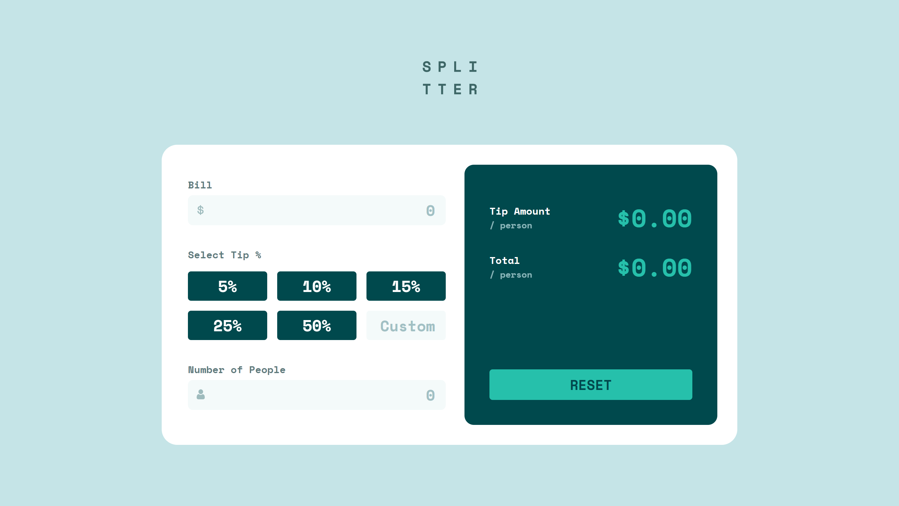
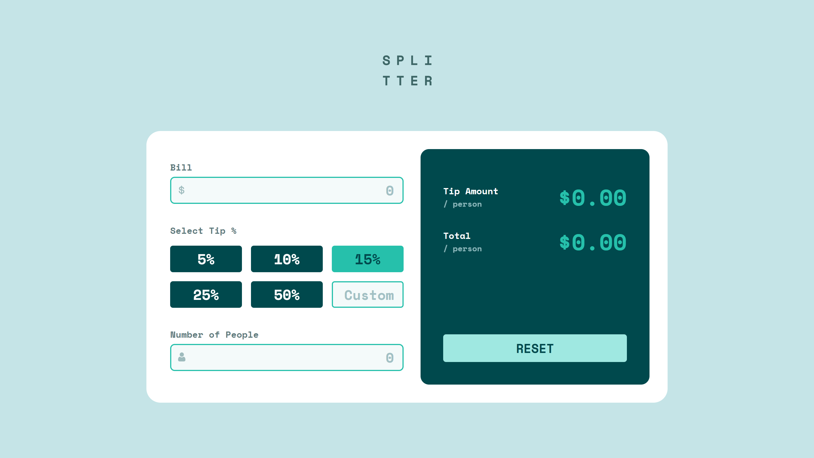
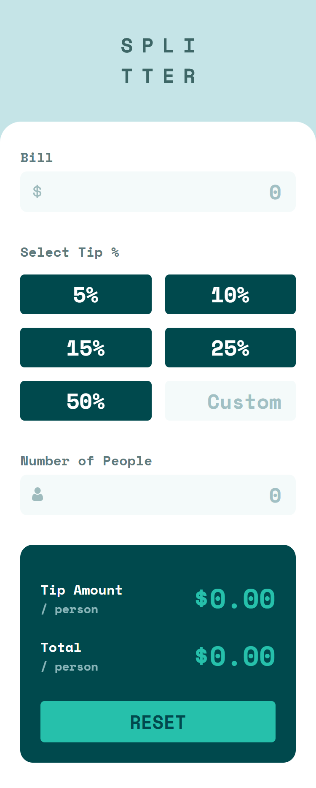

# Frontend Mentor - Tip calculator app solution

This is a solution to the [Tip calculator app challenge on Frontend Mentor](https://www.frontendmentor.io/challenges/tip-calculator-app-ugJNGbJUX). Frontend Mentor challenges help you improve your coding skills by building realistic projects.

## Table of contents

- [Overview](#overview)
  - [The challenge](#the-challenge)
  - [Screenshot](#screenshot)
  - [Links](#links)
- [My process](#my-process)
  - [Built with](#built-with)
- [Author](#author)

## Overview

### The challenge

Users should be able to:

- View the optimal layout for the app depending on their device's screen size
- See hover states for all interactive elements on the page
- Calculate the correct tip and total cost of the bill per person

### Screenshot

##### Desktop design

##### Active states

##### Mobile design

### Links

- Solution URL: [https://github.com/doomware/tip-calculator-app](https://github.com/doomware/tip-calculator-app)
- Live Site URL: [http://doomware.github.io/tip-calculator-app](http://doomware.github.io/tip-calculator-app)

## My process

### Built with

- CSS custom properties
- Flexbox
- Mobile-first workflow
- [React](https://reactjs.org/) - JS library
- [SCSS](https://sass-lang.com/) - For styles

## Author

- Frontend Mentor - [@doomware](https://www.frontendmentor.io/profile/doomware)
- Twitter - [@d00mwar3](https://twitter.com/d00mwar3)
